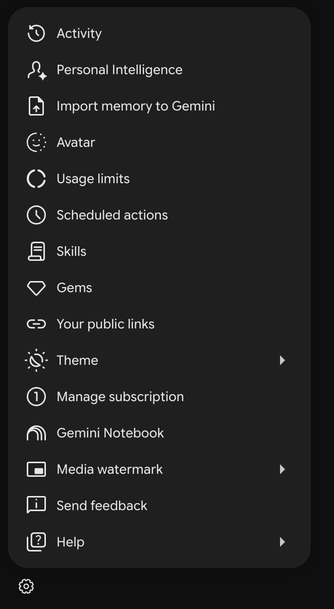
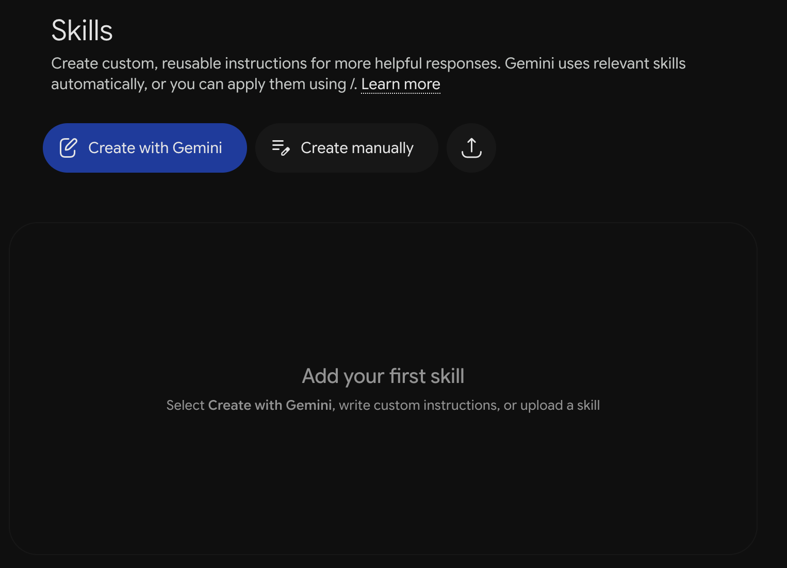
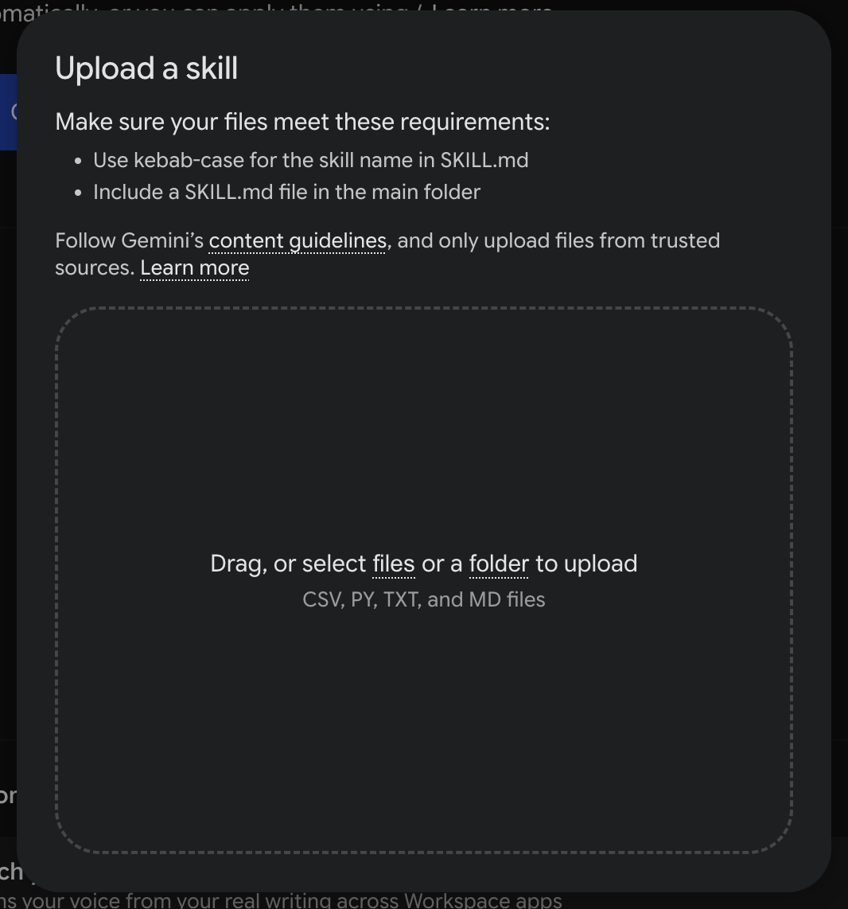
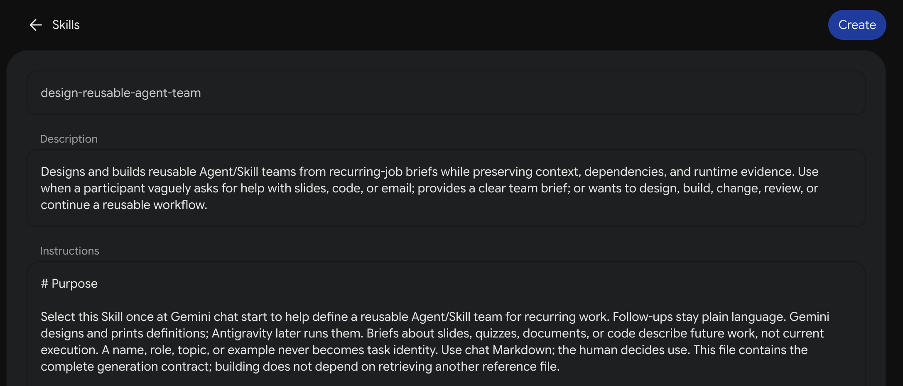
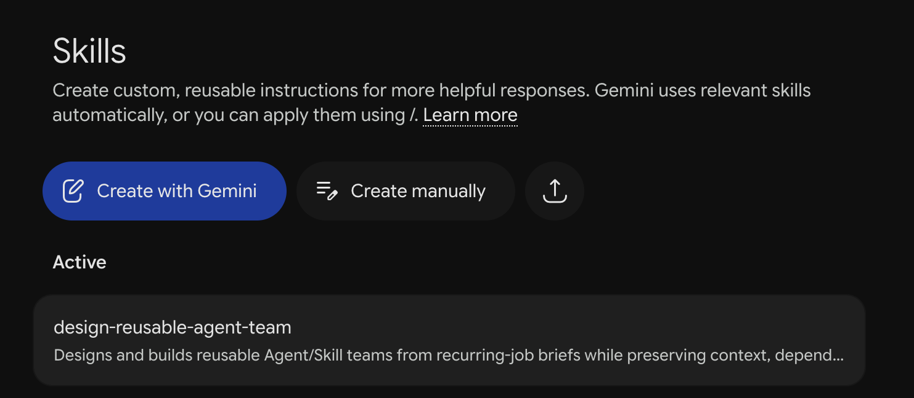

# Step 00 — Set up the Builder in Gemini

Install the Builder once, then use it to design and generate a reusable quiz team.

> **Warning:** Use **Flash** in Gemini.

## 1. Get the Builder Markdown file

Open [the Builder SKILL.md](./SKILL.md) and download the raw file as `SKILL.md`. This is the reusable Builder; the quiz team's own files will be generated in Step 01.

## 2. Open Settings → Skills

In Gemini, open the settings menu at the bottom left, then select **Skills**.

## 3. Upload the Builder

On the Skills page, select the **upload icon** beside Create manually.

Choose **select files** and select the downloaded `SKILL.md`.

## 4. Review and create

Check that the name is **design-reusable-agent-team** and that the description and instructions have loaded. Select **Create**.

## 5. Check Active

Confirm **design-reusable-agent-team** appears under **Active**. If Gemini shows it as inactive, open its actions and activate it before starting the workshop chat.

The images show the setup sequence supplied for this workshop. Active means the Builder is available. You will select it in your new chat in Step 01.

## Build your team

Open [Step 01 — Design and build the quiz team](../01-gemini-skill/README.md). If your account has no Skills access, use [Plan B](../99-no-gemini-skills-fallback/README.md).
