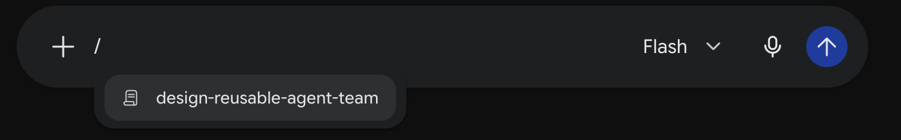
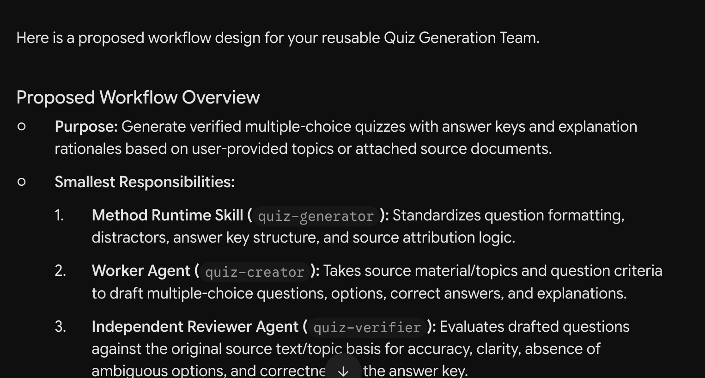
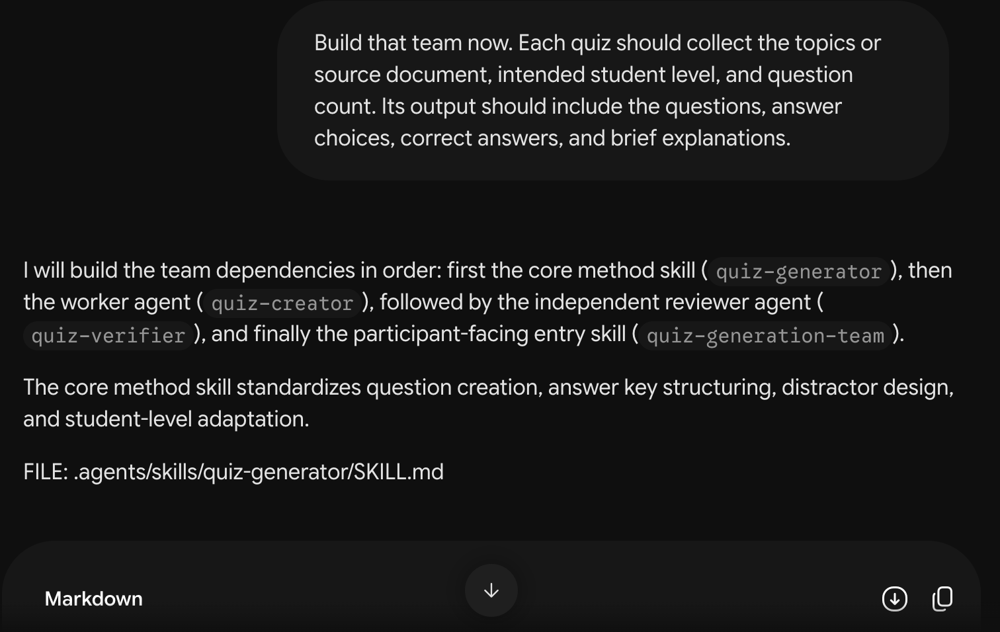
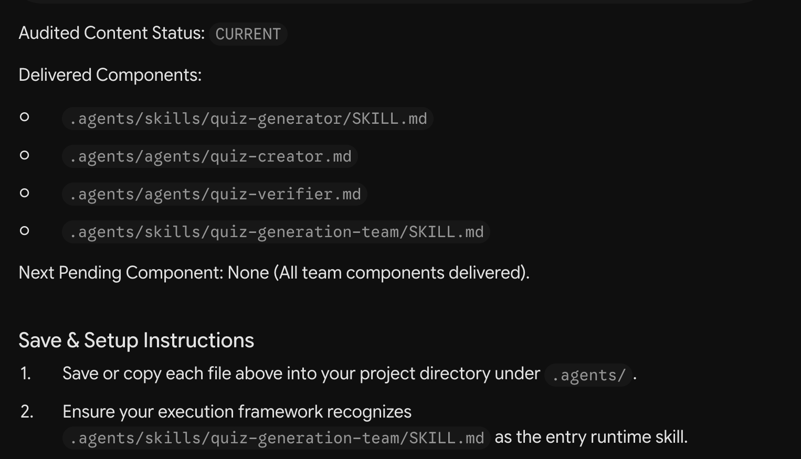
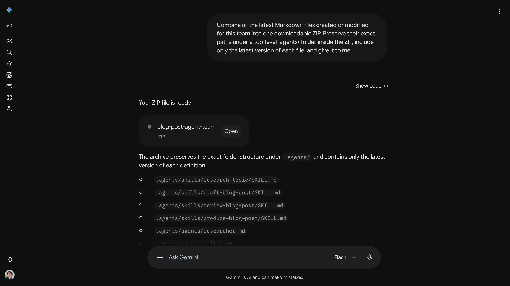

# Step 01 — Build your quiz team

Finish [Gemini setup](../00-gemini-setup/README.md) first. You are creating the team's instructions here; you will supply quiz topics or documents when running it in Antigravity.

> **Warning:** Use **Flash** in Gemini.

## 1. Select the Builder

Start a new Gemini chat. Select **Flash**, type `/`, and choose **design-reusable-agent-team** from the menu. Check that it is selected before sending your first message.



Select it at the start. Keep the same chat for the remaining prompts. If the Builder instructions become unavailable, select or supply the complete Skill again before resuming.

## 2. Describe the team you want

Send:

```text
I want a reusable team that generates multiple-choice quizzes for students from topics I provide or documents I attach. It should check the questions and answer key before delivering the quiz. Help me design the workflow first.
```


Gemini should explain who writes the quiz, who checks it and how the team works. Ask for changes if the plan does not match your goal.



## 3. Ask Gemini to build it

When the plan looks right, send:

```text
Build that team now. Each quiz should collect the topics or source document, intended student level, and question count. Its output should include the questions, answer choices, correct answers, and brief explanations.
```



Gemini explains each file and gives it to you one at a time.

Each build reply should end with a compact context checkpoint: the agreed scope, delivered and pending definitions, scoped authorization, evidence, and repair history. Keep the latest checkpoint alongside your downloads. It helps recover a long or restarted chat; it is not proof that the files were saved or tested.

## 4. Finish generating the team

Check each generated file is complete. Send `Continue` while another file is pending. Stop when:

- All four complete files have been generated.
- Every listed component says **CURRENT**.
- Gemini says **Next Pending Component: None**.
- The checkpoint says **Authorization: Closed**.



One file saying CURRENT does not mean the whole team is finished. You will check whether the saved team works in Antigravity.

If Gemini loses context, supply the latest checkpoint and the current definitions needed for the next dependency. In a fresh chat, select or supply the complete Builder first and state which pending build or agreed change you want to resume. Gemini should recover essential missing context before generating files. See [Recover a long or restarted Builder chat](../03-debug-and-improve/README.md#recover-a-long-or-restarted-builder-chat).

## 5. Save as a ZIP (recommended)

Once no files remain pending, send this in the same Gemini chat:

```text
Combine all the latest Markdown files created or modified for this team into one downloadable ZIP. Preserve their exact paths under a top-level .agents/ folder inside the ZIP, include only the latest version of each file, and give it to me.
```



Download and extract the ZIP into `my-team/`.

## 6. Save manually (optional)

Use the workshop's **my-team** folder, beside the numbered lessons. Create missing folders as needed. Every path after Gemini's `FILE:` label starts inside `my-team/`.

| Save the download here | What it does |
| --- | --- |
| `my-team/.agents/skills/quiz-generator/SKILL.md` | Explains how to write suitable questions and answers. |
| `my-team/.agents/agents/quiz-creator.md` | Writes the quiz. |
| `my-team/.agents/agents/quiz-verifier.md` | Independently checks the questions and answers. |
| `my-team/.agents/skills/quiz-generation-team/SKILL.md` | Asks for missing information and runs the team. |

If you prefer individual downloads:

1. Click **Download**, the circled downward arrow beside the copy icon.
2. Move the download to its exact location in the table. Rename it if needed; use `SKILL.md`, not `SKILL (1).md`.
3. Open it in a text editor and check that the whole file is present, including the information at the top. If it is incomplete, ask Gemini for the complete file.


The screenshot shows only part of the file. **Download** gets the file; do not select just the visible text. If your team uses different names, follow its exact `FILE:` locations.

## Try the initial team

At this point, you have four instruction files. `quiz-html-builder.md` is added later in Step 03.

Next, [try the team in Antigravity](../02-antigravity-setup/README.md) with **Gemini 3.6 Flash** to write and check a quiz. Keep this Gemini Builder chat so you can return to it in [Step 03](../03-debug-and-improve/README.md) to add the interactive page.
