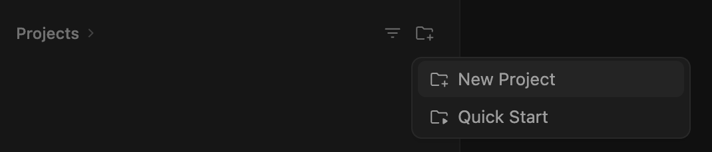
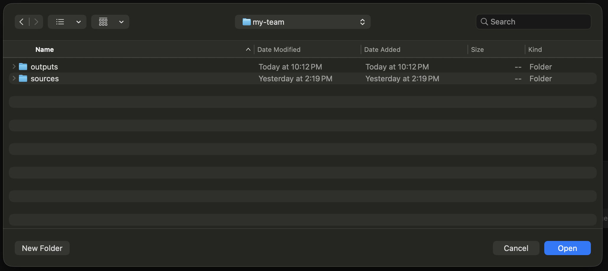
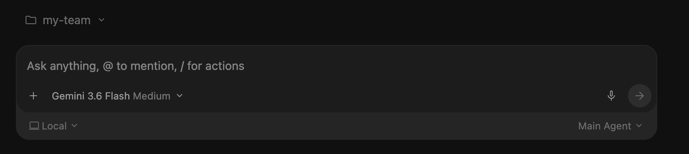
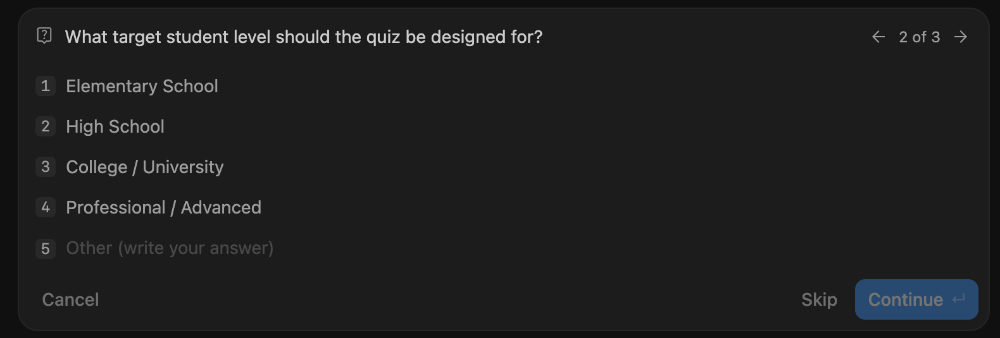
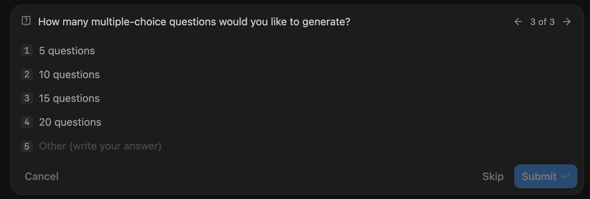

# Step 02 — Try your quiz team in Antigravity

Create a project, run your initial team and check the quiz and answer key.

> **Warning:** Use **Gemini 3.6 Flash** in Antigravity.

Have the four files from [building the team](../01-gemini-skill/README.md) saved first. This step tests the quiz creator and verifier. You will add `quiz-html-builder.md` in [Step 03](../03-debug-and-improve/README.md).

The screenshots were captured with the HTML extension already installed. Use them to locate the controls; HTML output and the third worker belong to Step 03.

## 1. Prepare your folder

Use the workshop's **my-team** folder. If it does not exist, create it beside the numbered lessons. Keep the four files you downloaded in Step 01.

Your folder should contain:

```text
my-team/
├── .agents/
│   ├── agents/
│   │   ├── quiz-creator.md
│   │   └── quiz-verifier.md
│   └── skills/
│       ├── quiz-generator/SKILL.md
│       └── quiz-generation-team/SKILL.md
├── sources/
└── outputs/
```

The creator writes and the verifier checks. `quiz-generator` explains the writing method; `quiz-generation-team` runs the team. Use the original team file from Step 01; the initial team delivers the quiz, answer key and explanations.

Choose how to save the files:

1. **ZIP (recommended):** Use [the ZIP prompt in Step 01](../01-gemini-skill/README.md#5-save-as-a-zip-recommended), then download and extract the ZIP into `my-team/`.
2. **Download and organize them yourself:** Download each Markdown file and place it under `my-team/` using Gemini's `FILE:` path and exact filename.

Create `outputs/` if needed. On macOS, **Command + Shift + .** shows hidden folders.

> **Screenshot 1 — Project folder:** Show my-team and the four instruction files from Step 01. Save as `02-project-folder.png`.

<!-- IMAGE SLOT: ../assets/antigravity/02-project-folder.png -->

## 2. Create the Antigravity project

1. Click the **folder with a +** beside **Projects**, then choose **New Project**.



1. Open your existing **my-team** folder and click **Open**. Choose the folder containing `.agents`, not `.agents` itself or the workshop parent. Hidden folders may not appear in this window.



1. Check **my-team** appears above the message box. Use **Local** and **Gemini 3.6 Flash**.



Your existing folder becomes the project. You do not need an app template or Git setup.

## 3. Trigger the main Skill

Start a fresh chat with **Gemini 3.6 Flash**. Before prompting, type `/` and select **quiz-generation-team**, the main Skill, from the menu.

This is the Skill that runs your quiz team. The Gemini Builder was used to create its instructions.

If the Skill is missing, check the folder and file locations, then start a fresh chat. Typing its name does not select it. The official [Skill guide](https://www.antigravity.google/docs/skills?tab=ide) explains where Skill files belong.


Select the result. Its name appears in the message box with a Skill icon. Keep it there and add your first request after it.


## 4. Let the team ask what it needs

With **quiz-generation-team** selected, send:

```text
I want to generate a multiple-choice quiz. Help me start.
```


The team asks for the topic, student level and number of questions. Answer each question before it begins.

## 5. Answer the three questions

For this walkthrough, choose:

1. **Python Basics** as the topic, then click **Continue**.


1. **College / University** as the student level, then click **Continue**.



1. **10 questions**, then click **Submit**. This starts the team.



You can choose **Other** to write your own answer. For a document-based quiz, attach the document or put it in `my-team/sources/` and give its path. The team must be able to read it before using it.


## 6. Watch the team work

Keep the same chat after submitting your answers. You do not need to reselect the Skill each turn.

The expected order is **write → independently check → correct if needed → check again → deliver the reviewed quiz**.

Look at the actual worker activity or its history. A response naming the workers alone does not prove they ran. If a worker cannot run or the reviewer cannot read the required material, stop that step and keep the error for [repair](../03-debug-and-improve/README.md#7-other-changes-and-repairs).

Open the activity panel to see the quiz creator and verifier. Open their details to read the review and check the order.

The example screenshot below was taken after Step 03, so it also shows **HTML Web App Builder**. Your initial four-file team should use only the creator and verifier.


## 7. Check the saved files

Open `my-team/outputs/` and the files named in the team's response. Use the actual filenames it reports.

Check for ten Python Basics questions at College / University level, four choices each, one correct answer and brief explanations. Read the review and any corrections. Confirm the reviewed quiz, answer key and explanations are saved. Check a few answers against the supplied topic or source material.

> **Screenshot 7 — Saved result:** Show the output files and the final response or review result. Save as `02-saved-result.png`.

<!-- IMAGE SLOT: ../assets/antigravity/02-saved-result.png -->

## 8. Add the interactive page

Read the final quiz and review before using or sharing it. If the reusable instructions need a correction, use [the Gemini repair guidance](../03-debug-and-improve/README.md#7-other-changes-and-repairs), save the replacements, then test again in a fresh Antigravity chat.

Once the initial team works, open [Step 03 — Add an interactive quiz page](../03-debug-and-improve/README.md). Return to your Gemini Builder chat to create `quiz-html-builder.md` and update the team instructions. Then rerun the extended team in this Antigravity project and check the page.

During our guided test, we will stop at each screenshot space and wait for your capture and **continue**. Work may finish between pauses; use activity history where needed. See [the screenshot list](../assets/antigravity/README.md).
