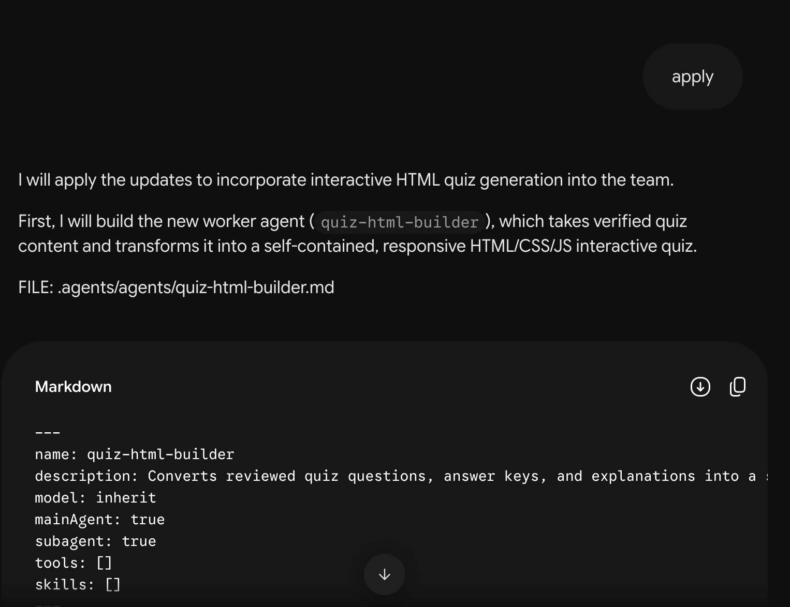
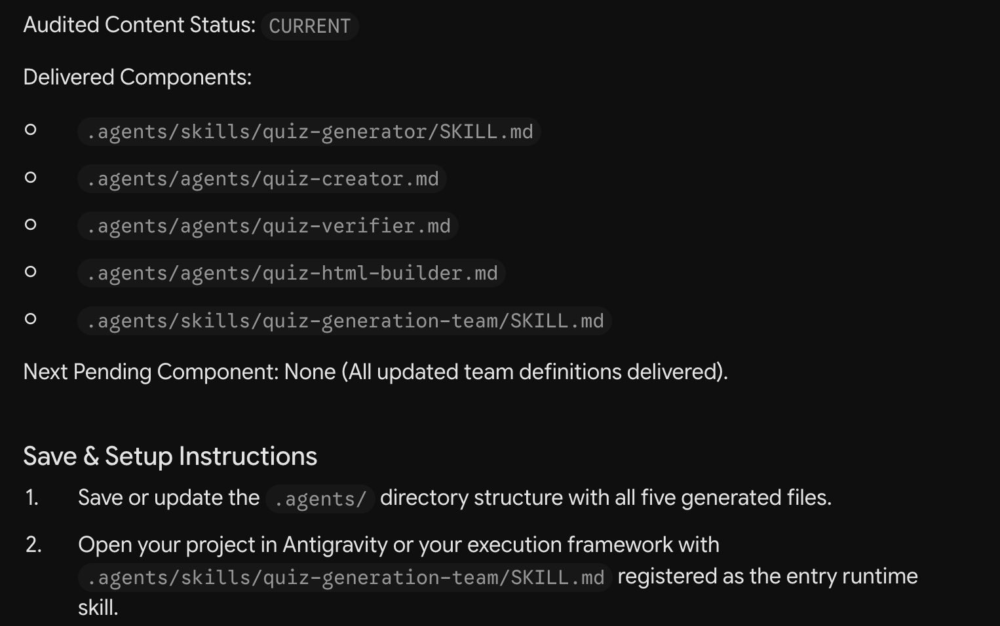

# Step 03 — Add an interactive quiz page

After [testing the four-file team in Step 02](../02-antigravity-setup/README.md), extend it to turn the reviewed quiz into a page where students can select answers and see their score and explanations. This step adds `quiz-html-builder.md` and replaces the team's `SKILL.md`, bringing the team to five files.

## 1. Ask Gemini for the change

> **Warning:** Use **Flash** in Gemini.

Return to the **same Gemini chat** used in Step 01. Keep **Flash** and the **design-reusable-agent-team** Skill selected before prompting. Send:

```text
Could we extend it so that, after the quiz passes review, it becomes a standalone interactive HTML quiz?
```

Check that Gemini proposes creating the page **after** the quiz has been checked.


## 2. Generate the new file

When the proposal looks right, send:

```text
apply
```

Gemini generates `quiz-html-builder.md`. This file tells the team how to turn a checked quiz into an interactive page.



## 3. Generate the updated team instructions

In the same Gemini chat, send:

```text
Continue
```

Gemini generates an updated `SKILL.md`. This tells the team to create the interactive page after the quiz passes review.

## 4. Check that Gemini is finished

Check each generated file is complete. Send `Continue` only while something remains pending.

You are finished when:

- All five team definitions are complete, including the new HTML builder and updated team instructions.
- Every listed component says **CURRENT**.
- Gemini says **Next Pending Component: None**.



Ask Gemini to complete any missing or incomplete file.

**ZIP (recommended):** Once nothing remains pending, send this in the same Gemini chat:

```text
Combine all the latest Markdown files created or modified for this team into one downloadable ZIP. Preserve their exact paths under a top-level .agents/ folder inside the ZIP, include only the latest version of each file, and give it to me.
```

Download the ZIP and merge its `.agents/` folder into `my-team/`, replacing updated files and keeping the others.

**Manual option:** Download each changed Markdown file and save it at its `FILE:` path under `my-team/`. Back up replaced files outside `.agents/`.

## 5. Run the extended team in Antigravity

> **Warning:** Use **Gemini 3.6 Flash** in Antigravity.

Return to **my-team** with **Local** and **Gemini 3.6 Flash**. Start a fresh chat, type `/`, and select **quiz-generation-team**, the main Skill, before sending your quiz request. Follow [Step 02's input steps](../02-antigravity-setup/README.md#4-let-the-team-ask-what-it-needs) if needed.

Your folder should now contain:

```text
my-team/
├── .agents/
│   ├── agents/
│   │   ├── quiz-creator.md
│   │   ├── quiz-verifier.md
│   │   └── quiz-html-builder.md
│   └── skills/
│       ├── quiz-generator/SKILL.md
│       └── quiz-generation-team/SKILL.md
├── sources/
└── outputs/
```

The expected order is **write → independently check → correct if needed → check again → create the HTML page**. HTML should be created only after the quiz passes review. Open the worker activity and details to confirm the creator, verifier and HTML builder ran in that order; worker names in a response alone do not prove execution.


Open `my-team/outputs/` and confirm both the reviewed quiz and HTML page are saved. Use the actual filenames reported by the team. In the example, the response links to **python_basics_quiz.html**.


## 6. Try the quiz page

Open the saved HTML file in a browser. Answer the questions and use its submit/check button.


- Check correct and incorrect answers show the right feedback.
- Compare the score with the reviewed answer key.
- Check explanations appear after answering or submitting.
- Try reset/retry if available.
- Check the page works as a standalone file, without a separate server.

Report any mismatch with the question, your choice and the displayed result. Recheck the correction before using or sharing the quiz.


This capture shows **5/10 (50%)**, correct-answer feedback and a **Retake Quiz** button. Check incorrect-answer explanations and the retake behavior too. The Antigravity image filenames keep their original `02-` prefix; these HTML results belong to the extended team in Step 03.

## 7. Other changes and repairs

For reusable changes, return to the original Gemini Builder chat with **Flash** selected. If its instructions are unavailable, select or supply the complete [Builder Skill](../00-gemini-setup/SKILL.md) again. Choose a relevant prompt below.

To improve explanations for future beginner quizzes:

```text
Update the reusable quiz team so quizzes for beginners explain unfamiliar terms in the answer explanations. Keep the existing student-level input question and independent review. Propose the changes first.
```

To repair a recurring verification problem, first paste the incorrect question and answer, the actual verifier report and the relevant source excerpt, then send:

```text
During an Antigravity run, the verifier accepted an answer that the source does not support. I have pasted the incorrect question and answer, the relevant source excerpt and the actual verifier report above. Find the cause and propose a change to the reusable team definitions so this is caught next time. Do not claim a runtime retest has passed.
```

To simplify the team:

```text
What is the smallest team design that still creates useful multiple-choice quizzes and independently checks the questions, answer key and explanations? Propose the changes before replacing any files.
```

Review the proposal and send `apply`. Send `Continue` while files remain pending, then use [the ZIP prompt above](#4-check-that-gemini-is-finished) to download and save the changes.

Save the replacements before starting a fresh Antigravity chat with **Gemini 3.6 Flash**. Select `quiz-generation-team`, repeat the affected scenario, and check the actual result before calling the fix successful.

For a different topic, level or question count on one quiz, tell the running team in Antigravity. Report a mistake in the current quiz there too; return to Gemini when the reusable instructions need changing.

### Recover a long or restarted Builder chat

Keep the latest context checkpoint with your downloads. It records scope, settled decisions, revisions, delivered and pending work, authorization, evidence and repair history; it does not prove files were saved or tested.

If Gemini loses context, supply the checkpoint and the relevant current definitions. In a fresh chat, select or supply the complete Builder Skill first and state which pending build or agreed change to resume. Recover missing context before generating files. `Continue` after completion should give the runtime handoff, not another definition.
