# Technical Manual: Quantum Computing Fundamentals, Algorithms, and Operational Workflows

---

## Part 1: Foundational Quantum Computing Concepts

### Section 1: Qubits, Dirac Notation, Hilbert Space & Bloch Sphere

#### 1.1 Qubit Fundamentals & Dirac Notation
The fundamental unit of quantum information is the **qubit** (quantum bit). Unlike a classical bit, which exists strictly in discrete states $0$ or $1$, a qubit exists in a complex vector space $\mathbb{C}^2$. Using Dirac bra-ket notation, the state of a single qubit $|\psi\rangle$ is expressed as a linear superposition of the canonical orthonormal basis states $|0\rangle$ and $|1\rangle$:

$$|\psi\rangle = \alpha |0\rangle + \beta |1\rangle = \alpha \begin{pmatrix} 1 \\ 0 \end{pmatrix} + \beta \begin{pmatrix} 0 \\ 1 \end{pmatrix} = \begin{pmatrix} \alpha \\ \beta \end{pmatrix}$$

where $\alpha, \beta \in \mathbb{C}$ are complex probability amplitudes.

- **Normalization Condition**: The state vector must satisfy total probability conservation:
  $$\langle \psi | \psi \rangle = |\alpha|^2 + |\beta|^2 = 1$$
- **Dual Vector (Bra)**: The conjugate transpose (Hermitian adjoint) of ket $|\psi\rangle$ is the bra $\langle \psi|$:
  $$\langle \psi| = |\psi\rangle^\dagger = \begin{pmatrix} \alpha^* & \beta^* \end{pmatrix}$$
- **Inner Product**: The inner product between two states $|\phi\rangle = \gamma|0\rangle + \delta|1\rangle$ and $|\psi\rangle$ is:
  $$\langle \phi | \psi \rangle = \gamma^* \alpha + \delta^* \beta$$
  If $\langle \phi | \psi \rangle = 0$, the states are orthogonal.
- **Outer Product**: The outer product creates an operator on Hilbert space:
  $$|\psi\rangle \langle \phi| = \begin{pmatrix} \alpha \\ \beta \end{pmatrix} \begin{pmatrix} \gamma^* & \delta^* \end{pmatrix} = \begin{pmatrix} \alpha \gamma^* & \alpha \delta^* \\ \beta \gamma^* & \beta \delta^* \end{pmatrix}$$

#### 1.2 Hilbert Space & Multi-Qubit Tensor Products
An $n$-qubit system spans a $2^n$-dimensional Hilbert space $\mathcal{H} = (\mathbb{C}^2)^{\otimes n}$. Joint quantum states are constructed via the tensor product $\otimes$. For two single-qubit states $|\psi\rangle = \alpha|0\rangle + \beta|1\rangle$ and $|\phi\rangle = \gamma|0\rangle + \delta|1\rangle$:

$$|\psi\rangle \otimes |\phi\rangle = |\psi\rangle |\phi\rangle = |\psi \phi\rangle = \begin{pmatrix} \alpha \begin{pmatrix} \gamma \\ \delta \end{pmatrix} \\ \beta \begin{pmatrix} \gamma \\ \delta \end{pmatrix} \end{pmatrix} = \begin{pmatrix} \alpha \gamma \\ \alpha \delta \\ \beta \gamma \\ \beta \delta \end{pmatrix}$$

#### 1.3 Bloch Sphere Geometry
Any pure single-qubit state $|\psi\rangle$ can be parameterized up to an unobservable global phase $e^{i\gamma}$ using two real spherical coordinates $\theta \in [0, \pi]$ and $\phi \in [0, 2\pi)$:

$$|\psi\rangle = \cos\left(\frac{\theta}{2}\right)|0\rangle + e^{i\phi}\sin\left(\frac{\theta}{2}\right)|1\rangle$$

- **North Pole ($\theta = 0$)**: Basis state $|0\rangle$.
- **South Pole ($\theta = \pi$)**: Basis state $|1\rangle$.
- **Equator ($\theta = \pi/2$)**: Equal superpositions.
  - $\phi = 0 \implies |+\rangle = \frac{|0\rangle + |1\rangle}{\sqrt{2}}$
  - $\phi = \pi \implies |-\rangle = \frac{|0\rangle - |1\rangle}{\sqrt{2}}$
  - $\phi = \pi/2 \implies |+i\rangle = \frac{|0\rangle + i|1\rangle}{\sqrt{2}}$
  - $\phi = 3\pi/2 \implies |-i\rangle = \frac{|0\rangle - i|1\rangle}{\sqrt{2}}$
- **Bloch Vector Coordinates**: The corresponding 3D Cartesian vector $(x, y, z)$ on the unit sphere is given by:
  $$x = \langle \psi | X | \psi \rangle = \sin\theta \cos\phi$$
  $$y = \langle \psi | Y | \psi \rangle = \sin\theta \sin\phi$$
  $$z = \langle \psi | Z | \psi \rangle = \cos\theta$$

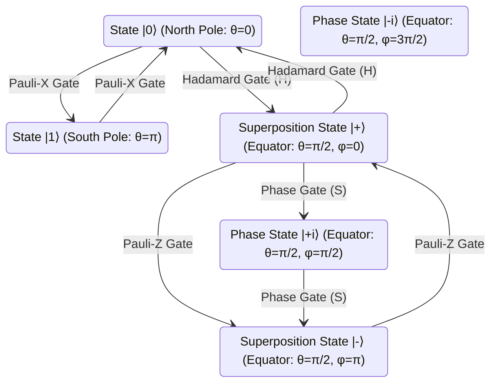

---

### Section 2: Quantum Gates & Unitary Operators

Quantum logic operations are reversible, linear transformations represented by unitary matrices $U \in U(2^n)$, satisfying $U^\dagger U = U U^\dagger = I$, where $U^\dagger = (U^*)^T$.

#### 2.1 Single-Qubit Gates
1. **Pauli Gates**:
   - **Pauli-X (Bit-flip / Quantum NOT)**:
     $$X = \begin{pmatrix} 0 & 1 \\ 1 & 0 \end{pmatrix}, \quad X|0\rangle = |1\rangle, \quad X|1\rangle = |0\rangle$$
   - **Pauli-Y (Bit & Phase-flip)**:
     $$Y = \begin{pmatrix} 0 & -i \\ i & 0 \end{pmatrix}, \quad Y|0\rangle = i|1\rangle, \quad Y|1\rangle = -i|0\rangle$$
   - **Pauli-Z (Phase-flip)**:
     $$Z = \begin{pmatrix} 1 & 0 \\ 0 & -1 \end{pmatrix}, \quad Z|0\rangle = |0\rangle, \quad Z|1\rangle = -|1\rangle$$

2. **Hadamard Gate ($H$)**: Creates equal superposition states from computational basis states.
   $$H = \frac{1}{\sqrt{2}} \begin{pmatrix} 1 & 1 \\ 1 & -1 \end{pmatrix}, \quad H|0\rangle = |+\rangle, \quad H|1\rangle = |-\rangle$$

3. **Phase Gates ($S, T$)**:
   - **$S$ Gate (Phase / $\pi/2$ Phase shift)**:
     $$S = \begin{pmatrix} 1 & 0 \\ 0 & i \end{pmatrix} = \begin{pmatrix} 1 & 0 \\ 0 & e^{i\pi/2} \end{pmatrix}, \quad S^2 = Z$$
   - **$T$ Gate ($\pi/4$ Phase shift / $\pi/8$ Gate)**:
     $$T = \begin{pmatrix} 1 & 0 \\ 0 & e^{i\pi/4} \end{pmatrix}, \quad T^2 = S$$

4. **Rotation Operators ($R_x, R_y, R_z$)**: Generates rotations about Bloch sphere axes by angle $\theta$:
   $$R_x(\theta) = \exp\left(-i\frac{\theta}{2}X\right) = \begin{pmatrix} \cos\frac{\theta}{2} & -i\sin\frac{\theta}{2} \\ -i\sin\frac{\theta}{2} & \cos\frac{\theta}{2} \end{pmatrix}$$
   $$R_y(\theta) = \exp\left(-i\frac{\theta}{2}Y\right) = \begin{pmatrix} \cos\frac{\theta}{2} & -\sin\frac{\theta}{2} \\ \sin\frac{\theta}{2} & \cos\frac{\theta}{2} \end{pmatrix}$$
   $$R_z(\theta) = \exp\left(-i\frac{\theta}{2}Z\right) = \begin{pmatrix} e^{-i\theta/2} & 0 \\ 0 & e^{i\theta/2} \end{pmatrix}$$

#### 2.2 Multi-Qubit Gates
1. **Controlled-NOT Gate (CNOT / CX)**: Flips target qubit $q_1$ if control qubit $q_0$ is in state $|1\rangle$.
   $$\text{CNOT} = |0\rangle\langle 0| \otimes I + |1\rangle\langle 1| \otimes X = \begin{pmatrix} 1 & 0 & 0 & 0 \\ 0 & 1 & 0 & 0 \\ 0 & 0 & 0 & 1 \\ 0 & 0 & 1 & 0 \end{pmatrix}$$
   Action: $|c, t\rangle \mapsto |c, t \oplus c\rangle$.

2. **SWAP Gate**: Exchanges the states of two qubits.
   $$\text{SWAP} = \begin{pmatrix} 1 & 0 & 0 & 0 \\ 0 & 0 & 1 & 0 \\ 0 & 1 & 0 & 0 \\ 0 & 0 & 0 & 1 \end{pmatrix}$$
   Constructed from three CNOTs: $\text{SWAP}_{12} = \text{CNOT}_{12} \cdot \text{CNOT}_{21} \cdot \text{CNOT}_{12}$.

3. **Toffoli Gate (CCNOT)**: 3-qubit gate flipping target qubit $q_2$ if both control qubits $q_0, q_1$ are $|1\rangle$.
   $$\text{CCNOT}|c_1, c_2, t\rangle = |c_1, c_2, t \oplus (c_1 \cdot c_2)\rangle$$

---

### Section 3: Quantum Measurement, Entanglement & Bell States

#### 3.1 Quantum Measurement & Expectation Values
Quantum measurement extracts classical information from a quantum state, projecting the wavefunction.

- **Projective Measurements (Von Neumann)**: Defined by Hermitian operators $M = \sum_m m P_m$, where $m$ are eigenvalues and $P_m = |m\rangle\langle m|$ are orthogonal projection operators ($\sum_m P_m = I$, $P_m P_k = \delta_{mk} P_m$).
- **Born Rule**: The probability of obtaining outcome $m$ when measuring state $|\psi\rangle$ is:
  $$p(m) = \langle \psi | P_m | \psi \rangle = |\langle m | \psi \rangle|^2$$
- **Post-Measurement State**: Immediately after obtaining outcome $m$, the state collapses to:
  $$|\psi'\rangle = \frac{P_m |\psi\rangle}{\sqrt{p(m)}}$$
- **Expectation Value**: The mean value of observable $A$ for state $|\psi\rangle$:
  $$\langle A \rangle = \langle \psi | A | \psi \rangle = \text{Tr}(A |\psi\rangle\langle\psi|)$$

#### 3.2 Quantum Entanglement & Bell States
A multi-qubit state $|\psi_{AB}\rangle \in \mathcal{H}_A \otimes \mathcal{H}_B$ is **entangled** if it cannot be factored into product states $|\phi_A\rangle \otimes |\chi_B\rangle$.

The four maximally entangled 2-qubit **Bell States** form an orthonormal basis (the Bell basis):

$$|\Phi^+\rangle = \frac{|00\rangle + |11\rangle}{\sqrt{2}}$$
$$|\Phi^-\rangle = \frac{|00\rangle - |11\rangle}{\sqrt{2}}$$
$$|\Psi^+\rangle = \frac{|01\rangle + |10\rangle}{\sqrt{2}}$$
$$|\Psi^-\rangle = \frac{|01\rangle - |10\rangle}{\sqrt{2}}$$

```
Circuit Diagram: Bell State |Φ⁺⟩ Preparation
q_0: |0⟩ ──[ H ]──■── |Φ⁺⟩ = 1/√2(|00⟩ + |11⟩)
                  │
q_1: |0⟩ ─────────X──
```

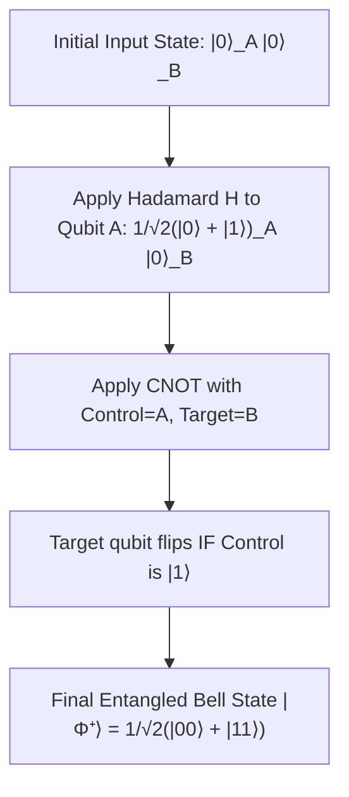

---

### Section 4: Quantum Communication Protocols

#### 4.1 Superdense Coding
Superdense coding allows a sender (Alice) to transmit two classical bits of information to a receiver (Bob) by sending only one qubit, given a pre-shared entangled Bell pair $|\Phi^+\rangle_{AB}$.

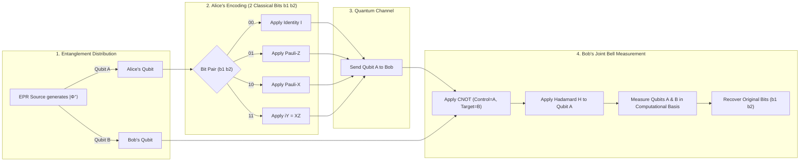

#### 4.2 Quantum Teleportation
Quantum teleportation transmits an arbitrary unknown single-qubit state $|\psi\rangle_C = \alpha|0\rangle + \beta|1\rangle$ from Alice to Bob using an entangled EPR pair $|\Phi^+\rangle_{AB}$ and 2 classical bits of communication.

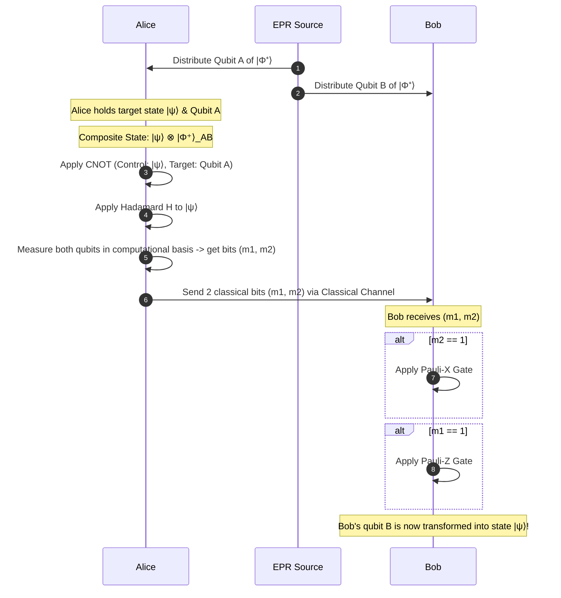

---

### Section 5: Quantum Oracle Algorithms

#### 5.1 Phase Kickback Mechanism
Setting ancilla qubit to $|-\rangle = H|1\rangle$:
$$U_f \left( |x\rangle |-\rangle \right) = (-1)^{f(x)} |x\rangle |-\rangle$$

```
Circuit Representation of Phase Kickback:
Control: |+⟩ = 1/√2(|0⟩ + |1⟩) ───■─── 1/√2(|0⟩ + e^{2πi φ}|1⟩)
                                  │
Target:  |u⟩ ─────────────────────[U]── |u⟩ (Eigenstate unchanged)
```

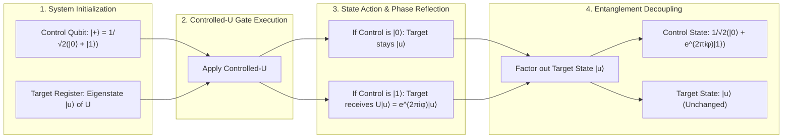

#### 5.2 Deutsch's Algorithm & Deutsch-Jozsa Algorithm
- **Problem**: Determine whether a boolean function $f: \{0,1\}^n \to \{0,1\}$ is constant or balanced in 1 query.

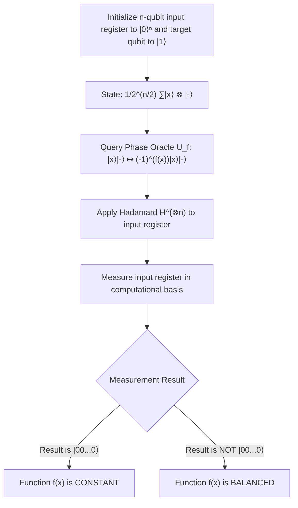

#### 5.3 Bernstein-Vazirani Algorithm
- **Problem**: Given oracle $f(x) = s \cdot x \pmod 2$ for secret bitstring $s \in \{0,1\}^n$, extract $s$ in 1 query.

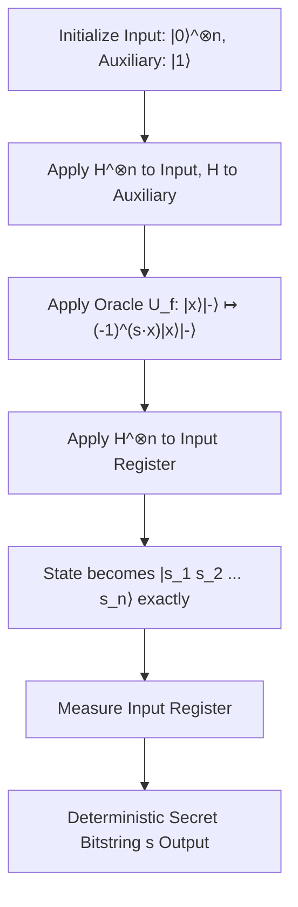

#### 5.4 Simon's Algorithm
- **Problem**: Find period $s \in \{0,1\}^n$ for function $f(x) = f(y) \iff x \oplus y \in \{0^n, s\}$.

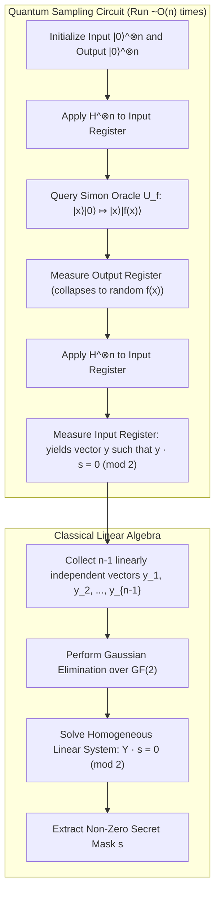

---

### Section 6: Quantum Fourier Transform & Phase Estimation

#### 6.1 Quantum Fourier Transform (QFT)
$$\text{QFT}|x\rangle = \frac{1}{\sqrt{N}} \sum_{y=0}^{N-1} e^{2\pi i x y / N} |y\rangle, \quad N = 2^n$$

```
3-Qubit QFT Quantum Circuit:
q_0: ──[H]──[R_2]──[R_3]─────────────────────────X──
              │      │                           │
q_1: ─────────■──────┼──────[H]──[R_2]───────────┼──
                     │             │             │
q_2: ────────────────■─────────────■──────[H]────X──
```

#### 6.2 Quantum Phase Estimation (QPE)
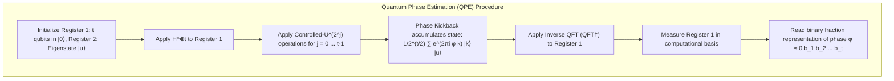

#### 6.3 Shor's Order-Finding Algorithm
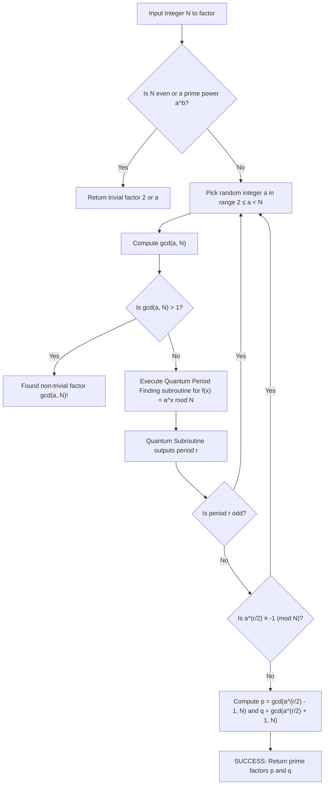

---

### Section 7: Quantum Search & Optimization

#### 7.1 Grover's Search Algorithm
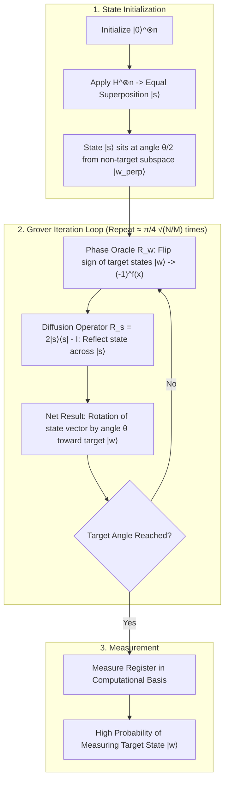

---

### Section 8: Quantum Error Correction (QEC)

#### 8.1 3-Qubit Bit-Flip Code
```
3-Qubit Bit-Flip Encoding & Syndrome Measurement Circuit:
Logical |ψ⟩: α|0⟩+β|1⟩ ──■──■───[ Error X_i ]───■──■─────────── [Recovery U_rec]
                       │  │                      │  │
Ancilla 1:        |0⟩ ─X──┼──────────────────────┼──┼──■──────── [Syndrome s_1]
                          │                      │  │  │
Ancilla 2:        |0⟩ ────X──────────────────────X──┼──┼──■───── [Syndrome s_2]
                                                    │  │  │
Ancilla 3:        |0⟩ ──────────────────────────────X──X──X─────
```

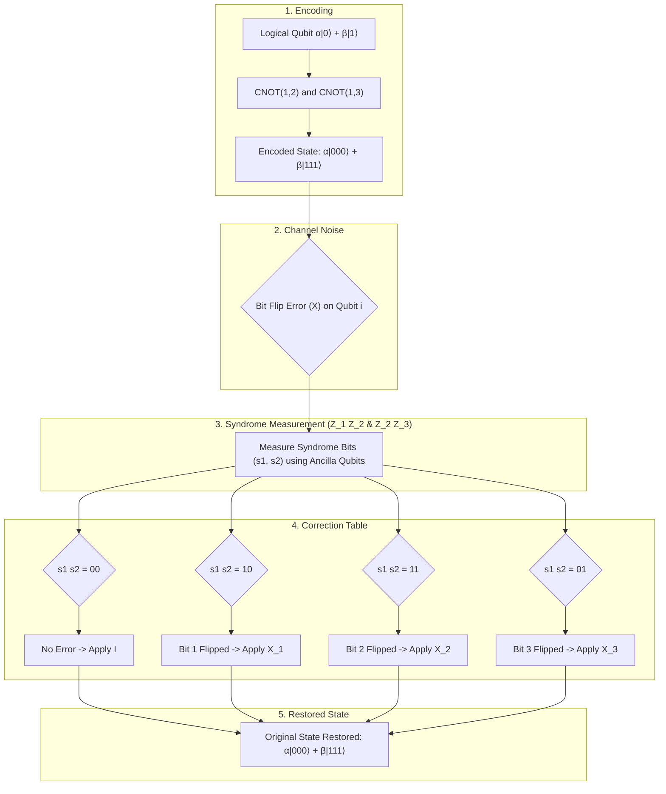

---

### Section 9: Variational & Hybrid Algorithms (VQE & QAOA)

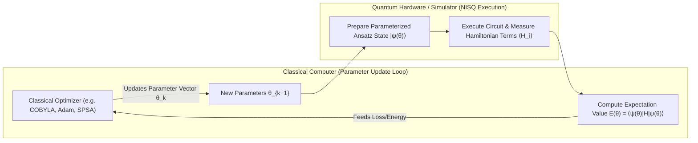

---

## Part 2: Step-by-Step Assignment Solving Workflows

### Workflow 1: Single-Qubit Operations & Bloch Sphere Mechanics
*(Covers Assignment 1)*

```
Step 1: State Vector Normalization Verification
  ├── Given unnormalized state vector v = [c0, c1]^T
  ├── Calculate total norm: N = sqrt(|c0|^2 + |c1|^2)
  └── Obtain normalized state: |psi> = (c0/N)|0> + (c1/N)|1>

Step 2: Gate Matrix Application
  ├── Multiply 2x2 Unitary matrix U by column vector |psi>
  └── |psi_out> = U · |psi>

Step 3: Bloch Sphere Parameter Extraction
  ├── Express alpha = |alpha| e^(i * phi_alpha), beta = |beta| e^(i * phi_beta)
  ├── Extract relative phase: phi = phi_beta - phi_alpha
  ├── Determine polar angle: theta = 2 * acos(|alpha|) = 2 * asin(|beta|)
  └── Compute Cartesian Bloch coordinates:
        x = sin(theta) * cos(phi)
        y = sin(theta) * sin(phi)
        z = cos(theta)

Step 4: Expectation Value Evaluation
  ├── Compute <X> = <psi| X |psi> = 2 * Re(alpha* · beta)
  ├── Compute <Y> = <psi| Y |psi> = 2 * Im(alpha* · beta)
  └── Compute <Z> = <psi| Z |psi> = |alpha|^2 - |beta|^2
```

---

### Workflow 2: Multi-Qubit Systems, Entanglement & Density Matrices
*(Covers Assignment 2)*

```
Step 1: Tensor Product Expansion
  ├── Given |psi_A> in C^2 and |psi_B> in C^2
  └── Evaluate |psi_AB> = |psi_A> (x) |psi_B> = [a0*b0, a0*b1, a1*b0, a1*b1]^T

Step 2: Bell State Generation Circuit Execution
  ├── Start with initial state |00>
  ├── Apply Hadamard H to Qubit 0: (H (x) I)|00> = 1/sqrt(2) (|00> + |10>)
  ├── Apply CNOT with control Qubit 0, target Qubit 1:
  └── Resulting state: |Phi+> = 1/sqrt(2) (|00> + |11>)

Step 3: Reduced Density Matrix & Entanglement Audit
  ├── Construct full density operator: rho_AB = |psi_AB><psi_AB|
  ├── Perform Partial Trace over Subsystem B:
  │     rho_A = Tr_B(rho_AB) = <0_B|rho_AB|0_B> + <1_B|rho_AB|1_B>
  ├── Calculate Purity: P = Tr(rho_A^2)
  └── Evaluate Entanglement:
        If P = 1 => Separable state
        If P < 1 (P = 0.5 for Bell states) => Entangled state
```

---

### Workflow 3: Quantum Teleportation & Superdense Coding Execution
*(Covers Assignment 3)*

```
Step 1: Teleportation Protocol Setup
  ├── Inputs: Qubit C in state |psi> = alpha|0> + beta|1>, EPR pair |Phi+> on Qubits A & B
  └── Full initial state: |psi_in> = |psi>_C (x) |Phi+>_AB

Step 2: Entangling Operations (Alice)
  ├── Apply CNOT gate (Control: C, Target: A)
  └── Apply Hadamard gate H to Qubit C

Step 3: Computational Basis Measurement (Alice)
  ├── Measure Qubits C and A to obtain classical bit pair (m_C, m_A)
  └── Transmit classical bits (m_C, m_A) to Bob via classical channel

Step 4: Conditional Pauli Recovery (Bob)
  ├── Case 00: Apply I to Qubit B
  ├── Case 01: Apply X to Qubit B
  ├── Case 10: Apply Z to Qubit B
  └── Case 11: Apply X · Z to Qubit B
  Result: Qubit B state is transformed exactly into alpha|0> + beta|1>
```

---

### Workflow 4: Deutsch & Deutsch-Jozsa Oracle Evaluation
*(Covers Assignment 4)*

```
Step 1: Register Initialization
  ├── Input register: n qubits set to |0>^(x n)
  └── Ancilla qubit: 1 qubit set to |1>

Step 2: Superposition & Phase Kickback Setup
  ├── Apply H^(x n) to input register => 1/sqrt(2^n) sum_x |x>
  └── Apply H to ancilla qubit => |-> = 1/sqrt(2) (|0> - |1>)

Step 3: Oracle U_f Application
  ├── Compute U_f |x>|-> = (-1)^(f(x)) |x>|->
  └── Phase (-1)^(f(x)) is kicked back to input register amplitudes

Step 4: Interference Transformation
  └── Apply H^(x n) to input register

Step 5: Measurement & Decision Rule
  ├── Measure input register in computational basis
  ├── Outcome = |0>^(x n) => Function f(x) is CONSTANT
  └── Outcome != |0>^(x n) => Function f(x) is BALANCED
```

---

### Workflow 5: Bernstein-Vazirani & Simon’s Periodicity Algorithm
*(Covers Assignment 5)*

```
[Part A: Bernstein-Vazirani Secret Extraction]
Step 1: Initialize registers H^(x n)|0>^(x n) and H|1> = |->
Step 2: Apply Oracle U_f: |x>|-> |-> (-1)^(s · x) |x>|->
Step 3: Apply H^(x n) to input register
Step 4: Measure input register. Outcome is deterministically secret bitstring s!

[Part B: Simon's Periodicity Discovery Algorithm]
Step 1: Initialize two n-qubit registers |0>^(x n) |0>^(x n)
Step 2: Apply H^(x n) to register 1 => 1/sqrt(2^n) sum_x |x>|0>
Step 3: Apply Oracle U_f: |x>|0> |-> |x>|f(x)>
Step 4: Measure register 2 (outcome f(x0))
Step 5: Apply H^(x n) to register 1
Step 6: Measure register 1 to obtain vector y satisfying y · s = 0 (mod 2)
Step 7: Repeat steps 1-6 to gather n-1 linearly independent vectors y^(1), ..., y^(n-1)
Step 8: Solve system Y · s = 0 over GF(2) via Gaussian elimination to reveal s
```

---

### Workflow 6: Quantum Fourier Transform (QFT) Circuit Construction & Execution
*(Covers Assignment 6)*

```
Step 1: Define Target System Size
  └── Determine register size n (e.g., n=3, N=8)

Step 2: QFT Circuit Construction Protocol
  ├── For qubit i = 0 to n-1:
  │     ├── Apply Hadamard H to qubit i
  │     └── For target j = i+1 to n-1:
  │           └── Apply Controlled-R_k phase rotation with control qubit j, target qubit i
  │                 where k = j - i + 1, and R_k = diag(1, e^(2*pi*i / 2^k))
  └── Apply Bit-Reversal SWAP gates between qubit i and qubit (n-1-i)

Step 3: Matrix Vector Multiplicative Verification
  ├── State transformation: |x> |-> 1/sqrt(N) sum_{y=0}^{N-1} e^(2*pi*i*x*y / N) |y>
  └── Calculate amplitude for output state |y>

Step 4: Inverse QFT (QFT^\dagger) Protocol
  ├── Reverse full gate order of QFT circuit
  └── Replace all R_k phase rotations with inverse rotations R_k^\dagger = R_k^(-1)
```

---

### Workflow 7: Quantum Phase Estimation (QPE) Execution Protocol
*(Covers Assignment 7)*

```
Step 1: Hardware Register Preparation
  ├── Counting register: t precision qubits initialized to |0>^(x t)
  └── Target register: initialized to eigenstate |psi> of unitary U

Step 2: Uniform Superposition Creation
  └── Apply H^(x t) to counting register

Step 3: Controlled Unitary Power Operations
  ├── Apply Controlled-U^(2^j) gates
  │     Control: Counting qubit j (for j = 0 to t-1)
  │     Target: Target register |psi>
  └── Accumulate phase phase e^(2*pi*i * 2^j * theta) onto counting qubit j

Step 4: Phase Reconstruction via Inverse QFT
  └── Apply QFT^\dagger to counting register

Step 5: Measurement & Phase Extraction
  ├── Measure counting register to read integer outcome b in [0, 2^t - 1]
  └── Compute phase estimate: theta_est = b / 2^t
```

---

### Workflow 8: Shor’s Order-Finding & Factorization Workflow
*(Covers Assignment 8)*

```
Step 1: Classical Pre-processing
  ├── Choose random integer a in range 1 < a < N
  ├── Compute g = gcd(a, N)
  └── If g > 1, factor found immediately (return g!). Else proceed to Quantum Step.

Step 2: Quantum Order Finding (QPE Loop)
  ├── Set up unitary U_a |y> = |a * y mod N>
  ├── Prepare counting register (t qubits) and target register initialized to |1>
  ├── Run QPE algorithm using Controlled-U_a^(2^j) operators
  └── Measure counting register to obtain phase phase_est = s / r

Step 3: Classical Order Extraction
  └── Apply Continued Fractions Expansion to phase_est to extract integer order r

Step 4: Factor Extraction & Validation Check
  ├── If r is ODD => Select new random a and restart Step 1
  ├── Compute x = a^(r/2) mod N
  ├── If x == -1 mod N (or x == N-1) => Select new random a and restart Step 1
  └── Compute non-trivial factors:
        p = gcd(x - 1, N)
        q = gcd(x + 1, N)
        Return factors (p, q)
```

---

### Workflow 9: Grover’s Search & Amplitude Amplification Step-by-Step
*(Covers Assignment 9)*

```
Step 1: Uniform Superposition Initialization
  └── Prepare initial state |s> = H^(x n)|0>^(x n) = 1/sqrt(N) sum_x |x>

Step 2: Optimal Iteration Count Calculation
  └── Compute R = round( (pi / 4) * sqrt(N / M) ), where M = number of target states

Step 3: Execute Grover Core Loop (Repeat R Times):
  │
  ├── Substep A: Apply Phase Oracle U_w
  │     ├── State update: |psi> |-> (I - 2|\omega><\omega|) |psi>
  │     └── Inverts sign of target state amplitude(s)
  │
  └── Substep B: Apply Diffusion Operator U_s
        ├── State update: |psi> |-> (2|s><s| - I) |psi>
        └── Inverts all amplitudes around mean average amplitude

Step 4: Computational Measurement
  ├── Measure register in computational basis
  └── Verify marked item condition f(x_measured) == 1
```

---

### Workflow 10: Quantum Error Correction (QEC) Syndrome Measurement & Recovery
*(Covers Assignment 10)*

```
Step 1: Logical Encoding Preparation
  └── Map physical data qubits according to code generator (e.g., |0_L> = |000>, |1_L> = |111>)

Step 2: Error Channel Transmission
  └── Environment introduces unknown Pauli error E in {I, X, Y, Z} on qubit k

Step 3: Stabilizer Syndrome Extraction
  ├── Prepare ancilla measurement qubits in state |0>
  ├── Apply entangling gates to evaluate parity checks:
  │     For 3-qubit bit flip: Measure S1 = Z1 Z2 and S2 = Z2 Z3
  └── Measure ancilla qubits to yield binary syndrome bitstring (s1, s2)

Step 4: Fault Diagnosis & Recovery Mapping
  ├── Look up error candidate k corresponding to syndrome bitstring (s1, s2)
  └── Apply recovery operator R = E_k^\dagger to data register

Step 5: Post-Correction State Verification
  └── Qubit state is completely restored to original logical state |psi_L>
```

---

### Workflow 11: Variational Quantum Eigensolver (VQE) & QAOA Optimization
*(Covers Assignment 11)*

```
Step 1: Problem Formulation & Hamiltonian Mapping
  ├── Map molecular system or graph topology to qubit Hamiltonian
  └── H = sum_k c_k P_k (where P_k are Pauli tensor products)

Step 2: Parameterized Ansatz Circuit Setup
  ├── Select variational circuit layout U(theta)
  └── Initialize parameter vector theta_0

Step 3: Quantum Execution & Expectation Measurement Loop (Iterative)
  ├── Prepare quantum state |psi(theta)> = U(theta) |0>^(x n)
  ├── For each Pauli term P_k in Hamiltonian:
  │     ├── Apply basis rotation gates (e.g., H for X basis, R_x(pi/2) for Y basis)
  │     ├── Measure in computational basis
  │     └── Estimate expectation value <P_k> = <psi(theta)| P_k |psi(theta)>
  └── Aggregate total energy: E(theta) = sum_k c_k * <P_k>

Step 4: Classical Optimization Step
  ├── Feed energy value E(theta) into classical optimizer (COBYLA, SPSA, Adam)
  ├── Compute parameter update theta_next
  └── Check convergence condition |E(theta_next) - E(theta)| < epsilon

Step 5: Final Result Extraction
  └── Return minimum eigenvalue estimate E_min and optimal parameters theta_opt
```

---

## Part 3: Page-to-Draft Coverage Table

| Draft Manual Section | Lecture Chapter & Assignment Source | Source Page / File Range | Coverage Topics & Key Mathematical Concepts |
| :--- | :--- | :--- | :--- |
| **Part 1 - Section 1** | Lecture CH1: Intro & Qubit Foundations<br>Lecture CH2: Hilbert Space & Dirac Notation<br>Lecture CH3: Bloch Sphere Geometry | CH1: pp. 1–28<br>CH2: pp. 1–34<br>CH3: pp. 1–22 | Qubit representation, Dirac ket/bra, Hilbert space $\mathbb{C}^2$, tensor products $\mathbb{C}^{2^n}$, inner/outer products, Bloch sphere parameters $(\theta, \phi)$, Cartesian mapping. |
| **Part 1 - Section 2** | Lecture CH4: Single-Qubit Gates<br>Lecture CH5: Multi-Qubit & Controlled Gates<br>Lecture CH6: Universal Gate Sets | CH4: pp. 1–30<br>CH5: pp. 1–36<br>CH6: pp. 1–24 | Unitary condition $U^\dagger U = I$, Pauli $X, Y, Z$, Hadamard $H$, $S$ and $T$ phase gates, $R_x, R_y, R_z$ rotations, CNOT matrix, SWAP decomposition, Toffoli (CCNOT). |
| **Part 1 - Section 3** | Lecture CH7: Quantum Measurement<br>Lecture CH8: Density Matrices & Pure/Mixed States<br>Lecture CH9: Entanglement & Bell States | CH7: pp. 1–26<br>CH8: pp. 1–40<br>CH9: pp. 1–32 | Projective measurement $P_m$, Born rule, state collapse, expectation values $\langle A \rangle$, 4 Bell states, density matrix $\rho$, partial trace $\text{Tr}_B(\rho)$, Schmidt decomposition. |
| **Part 1 - Section 4** | Lecture CH10: Quantum Teleportation<br>Lecture CH11: Superdense Coding | CH10: pp. 1–25<br>CH11: pp. 1–20 | 1-qubit teleportation protocol step-by-step, classical bit signaling, Pauli recovery operations, superdense coding 2-bit transmission protocol. |
| **Part 1 - Section 5** | Lecture CH12: Phase Kickback<br>Lecture CH13: Deutsch & Deutsch-Jozsa<br>Lecture CH14: Bernstein-Vazirani<br>Lecture CH15: Simon's Algorithm | CH12: pp. 1–18<br>CH13: pp. 1–32<br>CH14: pp. 1–24<br>CH15: pp. 1–30 | Phase kickback mechanism, Deutsch single-query constant/balanced test, Deutsch-Jozsa $n$-qubit extension, Bernstein-Vazirani secret search, Simon's periodicity algorithm & linear system over $\mathbb{Z}_2$. |
| **Part 1 - Section 6** | Lecture CH16: Quantum Fourier Transform<br>Lecture CH17: Quantum Phase Estimation<br>Lecture CH18: Shor's Order-Finding Algorithm | CH16: pp. 1–35<br>CH17: pp. 1–38<br>CH18: pp. 1–45 | QFT mathematical definition, product representation, controlled-$R_k$ circuit, QPE counting register execution, Shor's order finding, continued fractions, integer factorization. |
| **Part 1 - Section 7** | Lecture CH19: Grover's Search Algorithm<br>Lecture CH20: Amplitude Amplification | CH19: pp. 1–40<br>CH20: pp. 1–28 | Oracle $U_\omega$, diffuser $U_s = 2|s\rangle\langle s| - I$, geometric 2D rotation subspace, optimal iteration count $R \approx \frac{\pi}{4}\sqrt{N}$, generalized amplitude amplification. |
| **Part 1 - Section 8** | Lecture CH21: Intro to QEC & Noise Channels<br>Lecture CH22: 3-Qubit Bit/Phase Flip Code<br>Lecture CH23: Shor 9-Qubit & Steane 7-Qubit<br>Lecture CH24: Surface Code & Fault Tolerance | CH21: pp. 1–30<br>CH22: pp. 1–32<br>CH23: pp. 1–36<br>CH24: pp. 1–42 | Decoherence, 3-qubit bit-flip code syndrome extraction, parity operators $Z_1 Z_2, Z_2 Z_3$, Shor 9-qubit code concatenation, Steane 7-qubit CSS code, Surface code star/plaque stabilizers. |
| **Part 1 - Section 9** | Lecture CH25: NISQ Era Overview<br>Lecture CH26: Variational Quantum Eigensolver<br>Lecture CH27: QAOA Optimization<br>Lecture CH28: Quantum Machine Learning (QML) | CH25: pp. 1–22<br>CH26: pp. 1–38<br>CH27: pp. 1–34<br>CH28: pp. 1–36 | Variational principle, Ansatz preparation, Pauli expectation measurement, classical optimization loop (COBYLA/SPSA), QAOA Max-Cut Hamiltonian, QSVM kernels, QNN parameter shift rule. |
| **Part 2 - Workflow 1** | Assignment 1 File: `Assignment1_Bloch_Qubit.pdf` | pp. 1–6 | Single-qubit state normalization, gate multiplication, Bloch coordinates $(\theta, \phi)$, Pauli expectation values $\langle X \rangle, \langle Y \rangle, \langle Z \rangle$. |
| **Part 2 - Workflow 2** | Assignment 2 File: `Assignment2_Entanglement.pdf` | pp. 1–7 | Two-qubit state tensor expansion, Bell state circuit implementation, density matrix partial trace $\text{Tr}_B(\rho)$, purity computation. |
| **Part 2 - Workflow 3** | Assignment 3 File: `Assignment3_Teleportation.pdf` | pp. 1–8 | Step-by-step state transformation tracking for Quantum Teleportation and Superdense Coding protocols. |
| **Part 2 - Workflow 4** | Assignment 4 File: `Assignment4_DeutschJozsa.pdf` | pp. 1–6 | Deutsch and Deutsch-Jozsa algorithm execution, phase kickback mechanism, Hadamard interference measurement. |
| **Part 2 - Workflow 5** | Assignment 5 File: `Assignment5_BV_Simon.pdf` | pp. 1–8 | Bernstein-Vazirani single-query extraction; Simon's quantum state reduction, vector sampling, and GF(2) Gaussian elimination. |
| **Part 2 - Workflow 6** | Assignment 6 File: `Assignment6_QFT.pdf` | pp. 1–7 | QFT matrix formulation for $N=4$ and $N=8$, controlled-$R_k$ phase angle setup, inverse QFT implementation. |
| **Part 2 - Workflow 7** | Assignment 7 File: `Assignment7_QPE.pdf` | pp. 1–8 | Precision counting register setup, controlled-$U^{2^j}$ powers, inverse QFT execution, phase angle measurement. |
| **Part 2 - Workflow 8** | Assignment 8 File: `Assignment8_Shor.pdf` | pp. 1–10 | Order finding execution, period $r$ extraction using continuous fractions, $\gcd(a^{r/2} \pm 1, N)$ prime factorization steps. |
| **Part 2 - Workflow 9** | Assignment 9 File: `Assignment9_Grover.pdf` | pp. 1–7 | Phase oracle and diffuser operator implementation, 2D subspace rotation tracking, optimal iteration count computation. |
| **Part 2 - Workflow 10** | Assignment 10 File: `Assignment10_QEC.pdf` | pp. 1–9 | Stabilizer syndrome extraction, parity check tables ($Z_1 Z_2, Z_2 Z_3$), single-qubit recovery gate mapping. |
| **Part 10 - Workflow 11** | Assignment 11 File: `Assignment11_VQE_QAOA.pdf` | pp. 1–10 | Molecular/Graph Hamiltonian construction, parameterized Ansatz preparation, Pauli measurement expectation aggregation, hybrid optimization loop. |
